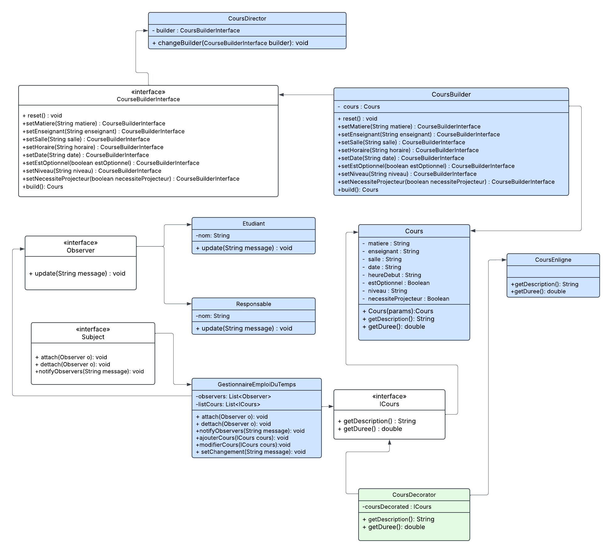

# Eleve : FADEL AKRAM
## SIAD

# Class Diagram

# Answer about software design principles.

## 1. CourseBuilderInterface 

### the `CourseBuilderInterface` violates *DIP* and *OCP* principle, it uses concrete type `Cours` in `build()` method, also any change in in the concrete `Cours` forces changes in the interface

## 2.  CoursBuilder

### teh `CoursBuilder` violated *DIP* because it implements `CourseBuilderInterface`

## 3. CoursDirector 

### the `CoursDirector` violates *DIP* and *OCP* because it depends on `CourseBuilderInterface`

## 4. GestionnaireEmploiDuTemps 
### it violates *SRP* because it mixes domain logic with presentation (printing), *OCP* violated because it hardcoded message formatting, any change in notification format requires changes in the class

## 5. Cours

### violates *SRP*, it encapsulates data but also handles representation with `getDescription` and `getDuree`.